# 🎮 App S10 – Registro y Gestión de Juegos con Firebase (ACTIVIDAD REALIZADA)

**App S10** es una app moderna construida con **Kotlin** para Android 11 (API 30), que ofrece autenticación de usuarios (incluyendo modo invitado) mediante Firebase Authentication y una base de datos en tiempo real para la gestión de videojuegos.

Cuenta con una interfaz amigable usando **Material Design 3**, navegación fluida entre actividades y persistencia en la nube.

---

## 🎯 Objetivo

Brindar una aplicación funcional y educativa que demuestre el uso práctico de Firebase Authentication y Realtime Database mediante la autentificacion de usuario junto a acciones CRUD

- Registrar juegos (título, género, calificación)
- Visualizar una lista de juegos
- Editar y eliminar juegos existentes
- Filtrar juegos por categoría usando un buscador

---

## 🚀 Funcionalidades

- ✅ Registro de juegos (título, género, calificación)
- 📋 Visualización de todos los juegos registrados
- 🗑️ Eliminación de juegos
- ✏️ Edición de juegos ya existentes
- 🔍 Filtro por categoría (género) mediante campo de búsqueda
- 🔐 Autenticación de usuario con Firebase Auth
- ☁️ Almacenamiento en tiempo real con Firebase Realtime Database
- 🎨 Interfaz responsiva y moderna con Material Design 3
---

## 🧩 Componentes de Material Design utilizados

- 🟪 **MaterialButton**  
  `com.google.android.material.button.MaterialButton`

- 🟦 **TextInputLayout + TextInputEditText**  
  `com.google.android.material.textfield.TextInputLayout`  
  `com.google.android.material.textfield.TextInputEditText`

- 🟫 **MaterialCardView**  
  `com.google.android.material.card.MaterialCardView`

- ⭐ **RatingBar**  
  `android.widget.RatingBar`

---

## 🛠️ Tecnologías utilizadas

- Android Studio Hedgehog o superior  
- Kotlin  
- Firebase Authentication  
- Firebase Realtime Database  
- Material Design 3  
- RecyclerView  
- ViewBinding

---

## 🖼️ Capturas de pantalla

### Vista Registrarse
La vista Registrarse permite a los nuevos usuarios crear una cuenta en la aplicación mediante correo electrónico y contraseña. Esta pantalla incluye validaciones básicas de entrada y conexión directa con Firebase Authentication.

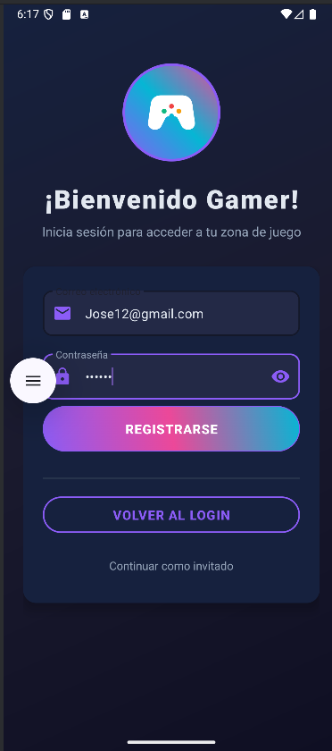

### Vista Iniciar Sesion
La vista Iniciar Sesión permite a los usuarios autenticarse en la aplicación utilizando su correo electrónico y contraseña registrados previamente. Está conectada con Firebase Authentication para verificar las credenciales de forma segura.

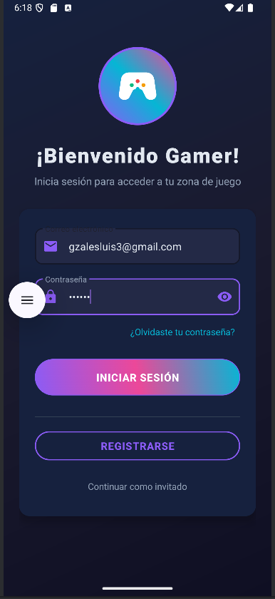

### Vista Invitado
La vista Invitado permite a los usuarios acceder a la aplicación sin necesidad de registrarse o iniciar sesión con un correo. Está diseñada para brindar acceso rápido con funciones limitadas, ideal para pruebas o usuarios que solo desean explorar la app sin compromiso.

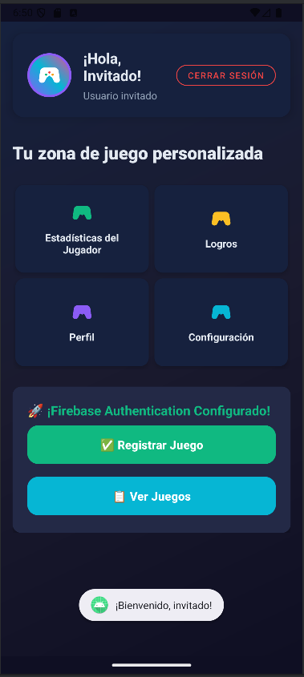

### Vista Verificcion De Ingreso
Una vez que el usuario se registra con un correo y contraseña, la aplicación verifica si su correo ha sido confirmado. Si no lo ha hecho, se muestra un diálogo emergente invitándolo a verificar su cuenta para poder usar completamente la aplicación.

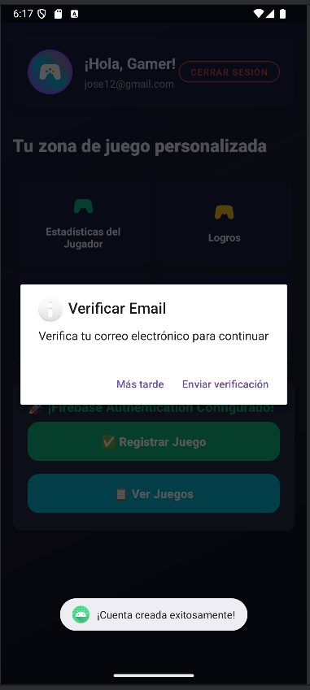

### Vista Aviso De Salida
Cuando el usuario intenta cerrar sesión desde la pantalla principal, se muestra un diálogo de confirmación para evitar salidas accidentales de la cuenta actual.

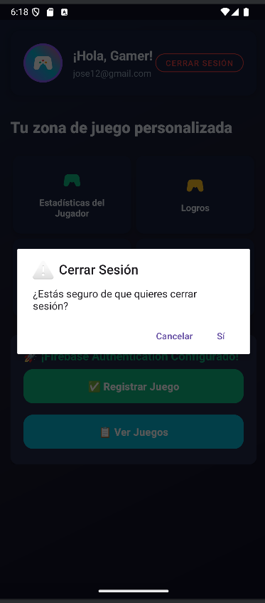

### Vista Menu Principal
La pantalla principal de la aplicación actúa como centro de navegación para acceder a las funcionalidades clave de la app. Esta vista se presenta luego del inicio de sesión exitoso 

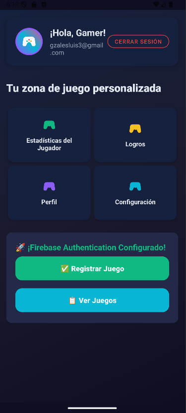

### Vista Registro Juego
La vista de Registro de Juego permite al usuario agregar un nuevo juego a su colección personal. Es una pantalla intuitiva con diseño moderno, que utiliza Material Design 3 y se conecta en tiempo real con Firebase Realtime Database.

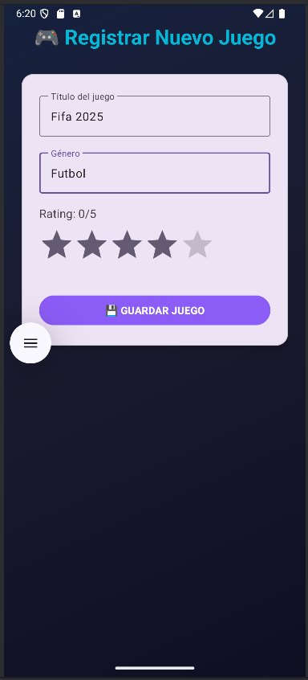

### Vista Lista De Juegos
La Vista Lista de Juegos muestra todos los juegos registrados por el usuario actual en formato de lista, utilizando un RecyclerView para una presentación eficiente y moderna. Cada juego se obtiene desde Firebase Realtime Database,

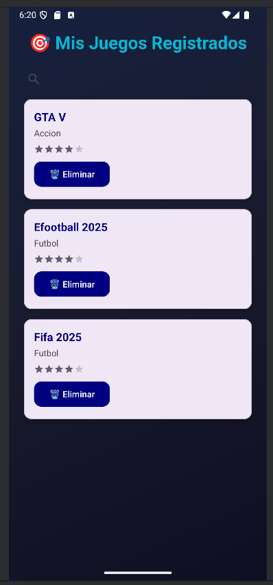

### Vista Eliminar Juego
La funcionalidad de Eliminar Juego está integrada directamente en la Vista Lista de Juegos, permitiendo al usuario eliminar cualquier juego registrado de forma rápida mediante un botón.

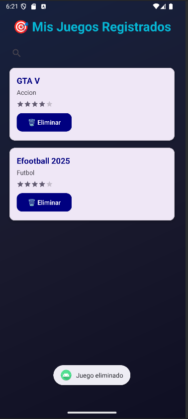

### Vista Editar Juego
La Vista Editar Juego permite modificar los detalles de un juego previamente registrado. Al hacer clic sobre un ítem en la lista de juegos, se abre esta pantalla con los datos del juego ya cargados.

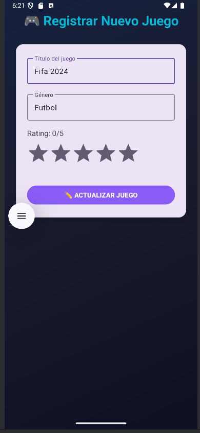

### Vista Buscador
La aplicación incorpora un buscador en la Lista de Juegos que permite filtrar los resultados en tiempo real según la categoría del juego (género).

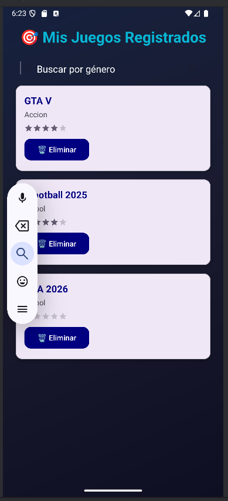

### Vista Filtrado por categoria
La aplicación muesta en pantalla los juegos filtados en base al genero que se busco.

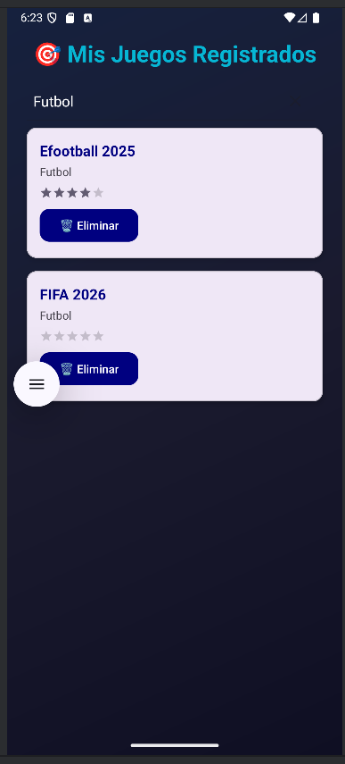

### Usuarios Autentificados en Consola de Firebase

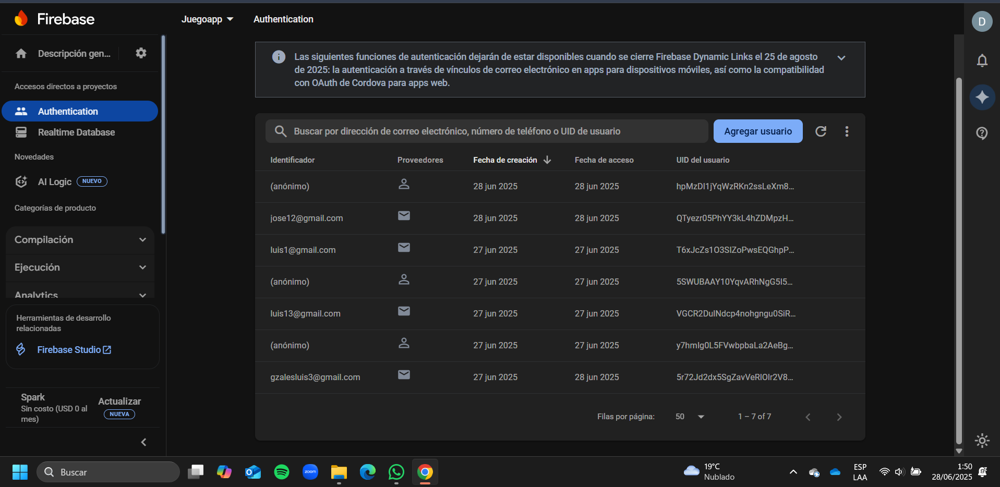

### Datos Almacenados En La Base De Datos En Tiempo Real Firebase

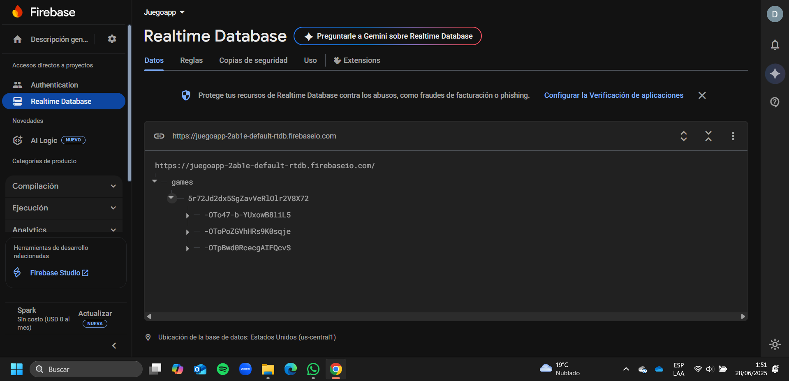

---

## ⚙️ Instalación

1. Clona este repositorio:
   
bash
   git clone https://github.com/luxo11GB/app_zone_app.git

2. Ábrelo en Android Studio  
3. Ejecuta el proyecto en un emulador o dispositivo físico con Android 11 o superior

## 👨‍💻 Autor

- **Nombre:** LuxoGB11  
- **Carrera:** Estudiante de Ingeniería de Sistemas e Informática  
- **Universidad:** Universidad Nacional del Santa  
- **GitHub:** [https://github.com/luxo11GB](https://github.com/luxo11GB)

## 📄 Licencia

Este proyecto se distribuye bajo la licencia MIT. Consulta el archivo `LICENSE` para más detalles.

### 🎮 **¡Happy Gaming & Coding!** 🎮

> Desarrollado con ❤️ para la comunidad de developers Android
